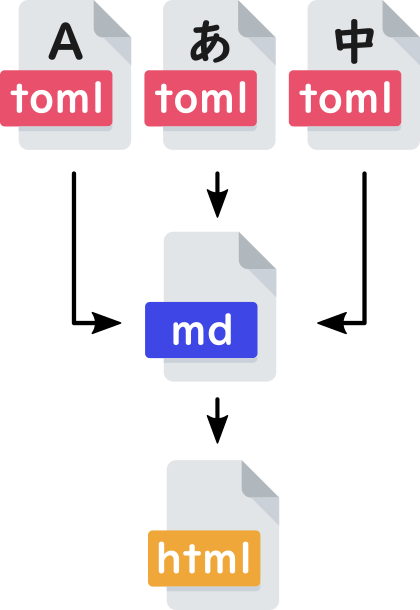

# Hugo multilanguage template

## :question: What is this?
[Hugo](https://gohugo.io/) is a static site generator. This generates HTML files from a template, so it has the advantage of reducing the load on the server compared to dynamic generation by script.

This project is a sample to easily build a multilanguage(i18n) environment by Hugo.

Hugo supports multilanguage just by preparing a folder. However, with that traditional way, you have to change all the .md files for each language if you have to change the layout even a little.

This template makes it possible to create language resources by using shortcodes.

If you write per-page text as toml, changes to the md file are minimal.

## :yen: Donate, please!

## :copyright: License
[MIT](http://opensource.org/licenses/MIT)